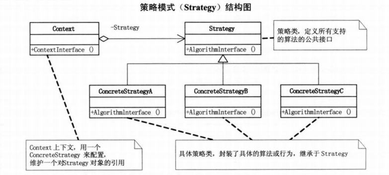

# 策略模式
策略模式 定义了算法家族，分别封装起来，让它们之间可以互相替换，此模式让算法的变化，不会影响到使用算法的客户。

策略模式是一种行为型模式。

## UML图
1.上下文 （Context） 维护指向具体策略的引用， 且仅通过策略接口与该对象进行交流。

2.策略 （Strategy） 接口是所有具体策略的通用接口， 它声明了一个上下文用于执行策略的方法。

3.具体策略 （Concrete Strategies） 实现了上下文所用算法的各种不同变体。

4.当上下文需要运行算法时， 它会在其已连接的策略对象上调用执行方法。 上下文不清楚其所涉及的策略类型与算法的执行方式。

5.客户端 （Client） 会创建一个特定策略对象并将其传递给上下文。 上下文则会提供一个设置器以便客户端在运行时替换相关联的策略。

